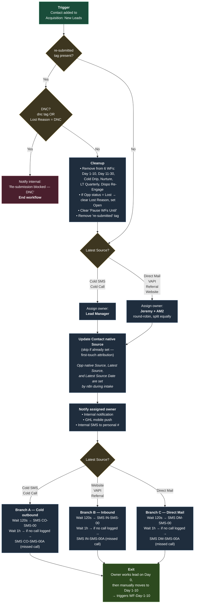

# Bana Land — New Leads Account: Workflow Diagrams
*Last edited: 2026-04-21 · Last reviewed: 2026-04-21*

Per-workflow internal-logic diagrams for the New Leads GHL sub-account. These are **informational** — [workflows.md](../workflows.md) remains the authoritative spec. If the diagrams drift from the spec, the spec wins.

Rendered with [Mermaid](https://mermaid.js.org/). Renders natively in VS Code's markdown preview and on GitHub.

---

## WF-New-Lead-Entry | New Lead Entry

Spec: [workflows.md:44-78](../workflows.md#L44-L78)

**Legend:**
- ■ Trigger — workflow entry
- ◆ Decision — branch point
- ■ Action — state change or side effect
- ■ Terminal — workflow ends here
- ■ Exit — hands off to next workflow

**Key behaviors:**
- **Re-submission cleanup is conditional on non-DNC.** If DNC is detected, the workflow ends immediately without cleanup — DNC state is permanent and must not be cleared.
- **Owner assignment uses "Only Apply to Unassigned Contacts"** so re-submitted leads keep their existing owner (see spec step 2).
- **Source fields are owned by n8n**, not this workflow. n8n sets Opportunity native Source (create only, first-touch), Latest Source, and Latest Source Date on every intake (create + re-submit). This workflow only sets **Contact native Source** as a first-touch mirror, because n8n's `contact_payload` doesn't include it.
- **Day 0 SMS branches are mutually exclusive** — a lead hits exactly one of A / B / C based on Latest Source.

---

*More workflow diagrams will be added here as needed. Current priority order for future diagrams: WF-Response-Handler (re-engagement branching), WF-Dispo-Re-Engage (Lost Reason branching), WF-Day-11-30 (RVM timing).*
